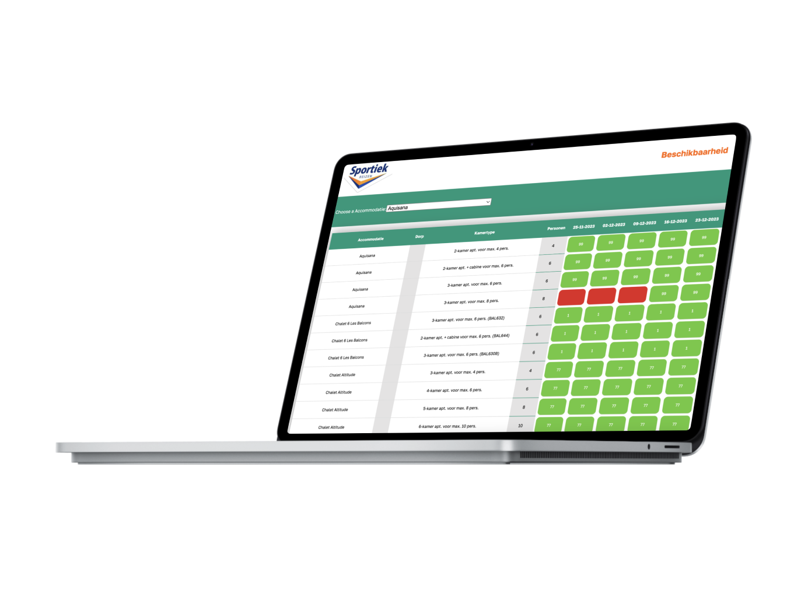

<!-- > _Fork_ deze leertaak en ga aan de slag. Onderstaande outline ga je gedurende deze taak in jouw eigen GitHub omgeving uitwerken. De instructie vind je in: [docs/INSTRUCTIONS.md](docs/INSTRUCTIONS.md) -->

# Dashboard Beschikbaarheid Sportiek Reizen
<!-- Geef je project een titel en schrijf in één zin wat het is -->

## Beschrijving
<!-- Bij Beschrijving staat kort beschreven wat voor project het is en wat je hebt gemaakt -->
<!-- Voeg een mooie poster visual toe 📸 -->
<!-- Voeg een link toe naar Github Pages 🌐-->

Voor Sportiek reizen heb ik website gemaakt waar de eindgebruiker snel kan zien welke accommodaties beschikbaar zijn en welke niet, de gebruikte informatie komt uit een database.

## Inhoudsopgave
  * [Kenmerken](#kenmerken)
  * [Installatie](#installatie)
  * [Gebruik](#gebruik)
  * [Bronnen](#bronnen)
  * [Licentie](#licentie)

## ⚡ Kenmerken
<!-- Bij Kenmerken staat welke technieken zijn gebruikt en hoe. Wat is de HTML structuur? Wat zijn de belangrijkste dingen in CSS? Wat is er met JS gedaan en hoe? Misschien heb je iets met NodeJS gedaan, of heb je een framwork of library gebruikt? -->

Dit project is gemaakt met NodeJS, EJS en CSS. Verder staat hieronder nog een korte lijst met gebruikte tools en middelen.

**Tools**

- 🖥️ VSCode
- ✍ Pen & Papier
- 🖼 Figma

**Gebruikte technieken**

- 📟 NodeJS
- 🚀 EJS
- 💅 CSS

## 📥 Installatie
<!-- Bij Instalatie staat hoe een andere developer aan jouw repo kan werken -->
1. Clone of download deze repository
2. Ga naar de root directory van het project.
3. Gebruik ``npm install`` express en ejs om de gebruikte dev dependencies en packages te installeren.
4. Gebruik de ``terminal`` ``npm start`` om een webserver te maken op poort 4242

## 🔨 Gebruik
<!-- Bij Gebruik staat de user story, hoe het werkt en wat je er mee kan. -->

De applicatie is lokaal te gebruiken voor de eindgebruiker, dat is in dit geval sportiek reizen. Aan de hand van twee tabellen kan je snel wat de beschikbaarheid is van de accommodaties. 

De userstory: snel de beschikbaarheid checken voor klanten die bellen.

## 📖 Bronnen

- [NodeJS](https://nodejs.org/en/)
- [EJS] (https://ejs.co/)
- [MDN] (https://developer.mozilla.org/en-US/)
- [YouTube] (https://www.youtube.com/)

## 🔓 Licentie

This project is licensed under the terms of the [MIT license](./LICENSE).
